# Catálogo interactivo de elementos de interfaz

Aplicación móvil que funciona como **catálogo interactivo de componentes de interfaz de usuario**. La misma aplicación se implementó en tres tecnologías para identificar los componentes básicos de una interfaz móvil, sus equivalencias entre plataformas y las diferencias entre el enfoque imperativo (Views/XML) y el declarativo (Jetpack Compose y Flutter).

Cada versión tiene una **pantalla principal** y **seis secciones**. En cada sección, cada elemento muestra su **nombre**, el **componente** con que se construyó, una **explicación breve** y una **demostración interactiva** que responde al usuario.

| # | Sección | Contenido |
|---|---------|-----------|
| 1 | Entrada de texto | Campo simple, validación con error, contraseña con mostrar/ocultar, teclados numérico/correo/teléfono, multilínea, sugerencias automáticas y barra de búsqueda |
| 2 | Botones y acciones | Relleno, contorno, texto, solo ícono, ícono + texto, FAB normal y extendido, selector segmentado, deshabilitado y en carga |
| 3 | Elementos de selección | Casillas (con estado indeterminado), botones de opción, interruptor, deslizador de valor y de rango, lista desplegable, fecha, hora y chips de filtro |
| 4 | Listas y colecciones | Lista de 20 elementos, cuadrícula, lista con encabezados, detalle al tocar, deslizar para eliminar (con deshacer), arrastrar para actualizar, estado vacío y pestañas deslizables |
| 5 | Información y retroalimentación | Estilos de texto, imagen local y desde URL con modos de escalado, progreso lineal/circular (determinado e indeterminado), toast, snackbar con acción, diálogo, hoja inferior, tarjeta, separador y badge |
| 6 | Contenedores y estructura | Fila, columna, superposición, desplazamiento, barra superior, barra de navegación inferior (y menú lateral en toda la app), pesos proporcionales y restricciones/sesgo |

**Requisitos transversales implementados en las tres versiones**

- **Navegación:** menú lateral con las seis secciones + Inicio; botón de regreso y botón «Inicio» en la barra superior de cada sección.
- **Tema claro y oscuro:** se adapta automáticamente al modo del sistema. Las tres versiones usan la misma paleta Material 3 generada con el color semilla `#006A60`.
- **Idioma:** todos los textos de la interfaz y la documentación están en español (en Flutter también los diálogos del sistema, mediante `flutter_localizations`).
- **Conexión entre secciones (dos):**
  1. Lo que se captura en la tarjeta «Conexión con la Sección 4» de la **Sección 1** se agrega a la lista compartida que se ve en la **Sección 4** (y la barra de búsqueda de la Sección 1 busca en esa misma lista).
  2. El deslizador de la **Sección 3** define el tamaño del texto de muestra en la **Sección 5**.

## Datos de identificación

| Campo | Dato |
|-------|------|
| Nombre completo | _[Escribe aquí tu nombre completo]_ |
| Número de boleta | _[Escribe aquí tu boleta]_ |
| Grupo | _[Escribe aquí tu grupo]_ |

## Tecnologías utilizadas

| Versión | Lenguaje | UI | Otras bibliotecas |
|---------|----------|----|-------------------|
| `android-views/` | Kotlin 2.0.20 | Views + layouts XML, Material Components 1.12.0 | AndroidX (Fragment, Lifecycle/ViewModel/LiveData, RecyclerView, ViewPager2, SwipeRefreshLayout, ConstraintLayout), Coil 2.7.0 |
| `android-compose/` | Kotlin 2.0.20 | Jetpack Compose (BOM 2024.09.00, Material 3 1.3.0) | Navigation Compose 2.8.0, Lifecycle ViewModel Compose, Coil Compose 2.7.0 |
| `flutter/` | Dart 3.9+ | Flutter 3.35+ (Material 3) | `flutter_localizations` (incluido en el SDK) |

Ambos proyectos Android usan Android Gradle Plugin 8.5.2, Gradle 8.9, `compileSdk`/`targetSdk` 34 y `minSdk` 26.

## Estructura del repositorio

```
android-views/     Versión con Views y XML (Kotlin + layouts XML, un Fragment por sección)
android-compose/   Versión con Jetpack Compose (un destino composable por sección)
flutter/           Versión con Flutter (una ruta por sección)
apk/               APK de cada versión
docs/              Capturas de pantalla (docs/views, docs/compose, docs/flutter)
shared/            Imagen local usada por las tres versiones
README.md          Este documento
```

## Compilación y ejecución

### Android Views (XML)

Requisitos: Android Studio (Koala o posterior) con JDK 17+ y el SDK de Android 34.

```bash
cd android-views
./gradlew assembleDebug        # en Windows: gradlew.bat assembleDebug
# APK: app/build/outputs/apk/debug/app-debug.apk
./gradlew installDebug         # instala en el emulador o dispositivo conectado
```

También puede abrirse la carpeta `android-views/` en Android Studio y pulsar **Run ▶**. Para el APK de release (firmado con la llave de depuración para poder instalarlo directamente): `./gradlew assembleRelease` → `app/build/outputs/apk/release/app-release.apk`.

### Jetpack Compose

Mismos requisitos que la versión de Views.

```bash
cd android-compose
./gradlew assembleDebug
# APK: app/build/outputs/apk/debug/app-debug.apk
./gradlew installDebug
```

### Flutter

Requisitos: Flutter 3.35 o posterior (canal estable) y el SDK de Android.

El repositorio contiene el código Dart (`lib/`), los recursos (`assets/`) y el `AndroidManifest.xml` (con el permiso de Internet). La primera vez se generan los demás archivos de la plataforma Android con `flutter create`, que **no sobrescribe** los archivos existentes:

```bash
cd flutter
flutter create . --project-name catalogo_ui --org mx.ipn.catalogo --platforms android
flutter pub get
flutter run                    # ejecuta en el emulador o dispositivo conectado
flutter build apk --release    # APK: build/app/outputs/flutter-apk/app-release.apk
```

### APK

Los APK generados se colocan en la carpeta [`apk/`](apk/):

| Versión | Archivo |
|---------|---------|
| Views / XML | [`apk/catalogo-views.apk`](apk/catalogo-views.apk) |
| Jetpack Compose | [`apk/catalogo-compose.apk`](apk/catalogo-compose.apk) |
| Flutter | [`apk/catalogo-flutter.apk`](apk/catalogo-flutter.apk) |

## Tabla de equivalencias

Componente utilizado para cada elemento del catálogo. Las celdas marcadas con **⚠** no tienen un equivalente directo en esa tecnología; se explica cómo se resolvió.

### Sección 1 · Entrada de texto

| Elemento | Views / XML | Jetpack Compose | Flutter |
|----------|-------------|-----------------|---------|
| Campo de texto con etiqueta | `TextInputLayout` + `TextInputEditText` | `OutlinedTextField(label)` | `TextField` + `InputDecoration(labelText)` |
| Campo con validación y error | `TextInputLayout.error`, `helperText`, `counterEnabled` | `OutlinedTextField(isError, supportingText)` | `InputDecoration(errorText, helperText)` + `maxLength` |
| Contraseña mostrar/ocultar | `TextInputLayout` `app:endIconMode="password_toggle"` + `inputType="textPassword"` | `PasswordVisualTransformation` + `trailingIcon` con `IconButton` | `TextField(obscureText)` + `suffixIcon` con `IconButton` |
| Teclado numérico / correo / teléfono | `android:inputType="number"` / `"textEmailAddress"` / `"phone"` | `KeyboardOptions(keyboardType = Number / Email / Phone)` | `keyboardType: TextInputType.number / emailAddress / phone` |
| Campo multilínea | `inputType="textMultiLine"` + `minLines` / `maxLines` | `OutlinedTextField(minLines, maxLines)` | `TextField(minLines, maxLines, keyboardType: multiline)` |
| Sugerencias automáticas | `MaterialAutoCompleteTextView` + `ArrayAdapter` | ⚠ Material 3 no tiene un *Autocomplete*: `OutlinedTextField` + lista filtrada de `ListItem` debajo del campo | `Autocomplete<String>` |
| Barra de búsqueda | `SearchView` (AppCompat) | `DockedSearchBar` + `SearchBarDefaults.InputField` | `SearchBar` |

### Sección 2 · Botones y acciones

| Elemento | Views / XML | Jetpack Compose | Flutter |
|----------|-------------|-----------------|---------|
| Botón relleno | `MaterialButton` | `Button` | `FilledButton` |
| Botón con contorno | `MaterialButton` (`Widget.Material3.Button.OutlinedButton`) | `OutlinedButton` | `OutlinedButton` |
| Botón de solo texto | `MaterialButton` (`Widget.Material3.Button.TextButton`) | `TextButton` | `TextButton` |
| Botón de solo ícono | `MaterialButton` con `?attr/materialIconButtonFilledStyle` / `OutlinedStyle` | `FilledIconToggleButton` / `OutlinedIconButton` | `IconButton.filled` / `IconButton.outlined` |
| Botón con ícono y texto | `MaterialButton` + `app:icon` | `Button { Icon(); Text() }` | `FilledButton.icon` |
| FAB normal | `FloatingActionButton` | `FloatingActionButton` | `FloatingActionButton` |
| FAB extendido | `ExtendedFloatingActionButton` (`shrink()` / `extend()`) | `ExtendedFloatingActionButton(expanded)` | `FloatingActionButton.extended(isExtended)` |
| Toggle / selector segmentado | `MaterialButtonToggleGroup` | `SingleChoiceSegmentedButtonRow` + `SegmentedButton` | `SegmentedButton<T>` |
| Botón deshabilitado | `isEnabled = false` | `Button(enabled = false)` | `onPressed: null` |
| Botón en estado de carga | ⚠ `MaterialButton` + `CircularProgressIndicator` superpuestos en un `FrameLayout` | `CircularProgressIndicator` como contenido del `Button` | `CircularProgressIndicator` como `child` del `FilledButton` |

### Sección 3 · Elementos de selección

| Elemento | Views / XML | Jetpack Compose | Flutter |
|----------|-------------|-----------------|---------|
| Casilla de verificación | `MaterialCheckBox` | `Checkbox` | `Checkbox` / `CheckboxListTile` |
| Casilla indeterminada | `MaterialCheckBox.checkedState = STATE_INDETERMINATE` | `TriStateCheckbox(ToggleableState.Indeterminate)` | `Checkbox(tristate: true, value: null)` |
| Botones de opción | `RadioGroup` + `MaterialRadioButton` | `RadioButton` + `Modifier.selectable` / `selectableGroup()` (el grupo lo define el estado, no un contenedor) | `RadioGroup` + `RadioListTile` |
| Interruptor | `MaterialSwitch` | `Switch` | `Switch` / `SwitchListTile` |
| Deslizador | `Slider` | `Slider` | `Slider` |
| Deslizador de rango | `RangeSlider` | `RangeSlider` | `RangeSlider` |
| Lista desplegable | `TextInputLayout` (ExposedDropdownMenu) + `MaterialAutoCompleteTextView` | `ExposedDropdownMenuBox` | `DropdownMenu<T>` |
| Selector de fecha | `MaterialDatePicker` | `DatePickerDialog` + `DatePicker` | `showDatePicker` |
| Selector de hora | `MaterialTimePicker` | ⚠ Material 3 1.3 no incluye `TimePickerDialog`: `TimePicker` dentro de un `AlertDialog` | `showTimePicker` |
| Chips de filtro | `ChipGroup` + `Chip` (`Widget.Material3.Chip.Filter`) | `FilterChip` + `FlowRow` | `FilterChip` + `Wrap` |

### Sección 4 · Listas y colecciones

| Elemento | Views / XML | Jetpack Compose | Flutter |
|----------|-------------|-----------------|---------|
| Lista vertical (20 elementos) | `RecyclerView` + `LinearLayoutManager` + `ListAdapter` | `LazyColumn` | `ListView.builder` / `ListView.separated` |
| Cuadrícula | `RecyclerView` + `GridLayoutManager` | `LazyVerticalGrid` | `GridView.count` |
| Lista con encabezados (2 tipos) | `RecyclerView` con `getItemViewType()` y dos `ViewHolder` | `LazyColumn` + `stickyHeader` | `ListView.builder` + `sealed class` con dos tipos de fila |
| Seleccionar y ver detalle | `OnClickListener` + `MaterialAlertDialogBuilder` | `Modifier.clickable` + `AlertDialog` | `ListTile.onTap` + `showDialog` |
| Deslizar para eliminar | `ItemTouchHelper.SimpleCallback` | `SwipeToDismissBox` | `Dismissible` |
| Arrastrar para actualizar | `SwipeRefreshLayout` | `PullToRefreshBox` | `RefreshIndicator` |
| Estado vacío | ⚠ No existe componente: `LinearLayout` con ícono y texto que se muestra con `View.VISIBLE` / `GONE` | ⚠ Composable condicional (`if (lista.isEmpty())`) | ⚠ Widget condicional (`lista.isEmpty ? … : …`) |
| Pestañas deslizables | `TabLayout` + `ViewPager2` + `TabLayoutMediator` | `TabRow` + `Tab` + `HorizontalPager` | `TabBar` + `TabBarView` + `TabController` |

### Sección 5 · Información y retroalimentación

| Elemento | Views / XML | Jetpack Compose | Flutter |
|----------|-------------|-----------------|---------|
| Textos con estilos | `TextView` + `textAppearance` / `textStyle` / `SpannableString` | `Text` + `MaterialTheme.typography` / `AnnotatedString` | `Text` + `TextTheme` / `Text.rich` |
| Imagen local | `ImageView` (`@drawable`) | `Image(painterResource)` | `Image.asset` |
| Imagen desde URL | ⚠ `ImageView` + biblioteca Coil (`load(url)`) | ⚠ `AsyncImage` de la biblioteca Coil | `Image.network` (integrado) |
| Modos de escalado | `scaleType`: `centerCrop`, `fitCenter`, `center`, `fitXY` | `ContentScale`: `Crop`, `Fit`, `Inside`, `FillBounds` | `BoxFit`: `cover`, `contain`, `none`, `fill` |
| Progreso lineal | `LinearProgressIndicator` | `LinearProgressIndicator` | `LinearProgressIndicator` |
| Progreso circular | `CircularProgressIndicator` | `CircularProgressIndicator` | `CircularProgressIndicator` |
| Toast | `Toast` | `Toast` (API de Android mediante `LocalContext`) | ⚠ No existe: función propia `mostrarToast()` con un `OverlayEntry` temporal |
| Snackbar con acción | `Snackbar.make().setAction()` | `SnackbarHost` + `SnackbarHostState.showSnackbar()` | `ScaffoldMessenger.showSnackBar` + `SnackBarAction` |
| Diálogo de confirmación | `MaterialAlertDialogBuilder` | `AlertDialog` | `showDialog` + `AlertDialog` |
| Hoja inferior | `BottomSheetDialog` | `ModalBottomSheet` | `showModalBottomSheet` |
| Tarjeta | `MaterialCardView` | `ElevatedCard` / `OutlinedCard` | `Card` |
| Separador | `MaterialDivider` | `HorizontalDivider` | `Divider` |
| Badge numérico | ⚠ `BadgeDrawable` solo se adjunta sin APIs experimentales a barras de navegación (se usa en la Sección 6); en la Sección 5 se resolvió con un `TextView` con fondo redondeado sobre el ícono | `BadgedBox` + `Badge` | `Badge` |

### Sección 6 · Contenedores y estructura

| Elemento | Views / XML | Jetpack Compose | Flutter |
|----------|-------------|-----------------|---------|
| Fila | `LinearLayout` horizontal | `Row` | `Row` |
| Columna | `LinearLayout` vertical | `Column` | `Column` |
| Superpuesta | `FrameLayout` | `Box` | `Stack` + `Align` |
| Desplazamiento vertical | `NestedScrollView` | `Modifier.verticalScroll` | `SingleChildScrollView` |
| Barra superior | `MaterialToolbar` | `TopAppBar` | `AppBar` |
| Navegación inferior | `BottomNavigationView` | `NavigationBar` + `NavigationBarItem` | `NavigationBar` + `NavigationDestination` |
| Menú lateral (usado en toda la app) | `DrawerLayout` + `NavigationView` | `ModalNavigationDrawer` + `ModalDrawerSheet` | `Drawer` (`NavigationDrawer`) |
| Pesos proporcionales | `android:layout_weight` | `Modifier.weight()` | `Expanded(flex)` |
| Restricciones | `ConstraintLayout` (`layout_constraintHorizontal_bias`) | ⚠ No forma parte del kit base (existe la biblioteca `constraintlayout-compose`); se resolvió con `BiasAlignment` | ⚠ Flutter no usa restricciones entre vistas; se resolvió con `Align(alignment: Alignment(x, y))` |

### Aspectos generales

| Aspecto | Views / XML | Jetpack Compose | Flutter |
|---------|-------------|-----------------|---------|
| Pantallas / secciones | `Fragment` + `FragmentManager` (pila de regreso) | `NavHost` + `composable(ruta)` | `Navigator` + rutas con nombre |
| Estado compartido | `ViewModel` + `LiveData` (`activityViewModels()`) | `ViewModel` + `mutableStateListOf` / `mutableFloatStateOf` | `ChangeNotifier` + `InheritedNotifier` |
| Tema claro/oscuro | `Theme.Material3.DayNight` + `values-night/` | `isSystemInDarkTheme()` + `darkColorScheme` | `ThemeMode.system` + `darkTheme` |
| Tarjeta de documentación | Vista propia `DemoCard` (`LinearLayout` con atributos XML) | Composable `DemoCard` | Widget `DemoCard` |

## Capturas de pantalla

Las capturas se guardan en `docs/` con los nombres indicados en [`docs/README.md`](docs/README.md).

| Pantalla | Views / XML | Jetpack Compose | Flutter |
|----------|:-----------:|:---------------:|:-------:|
| Inicio | 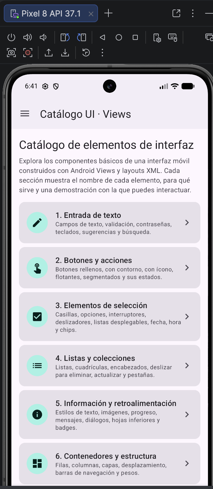 | 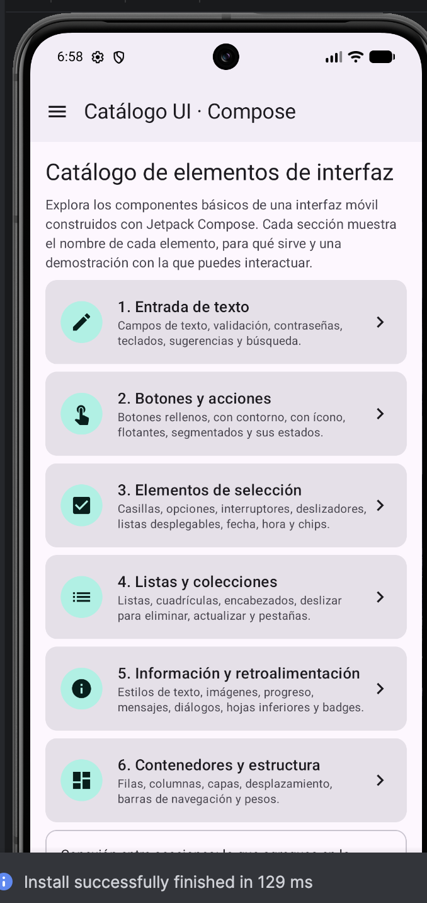 | 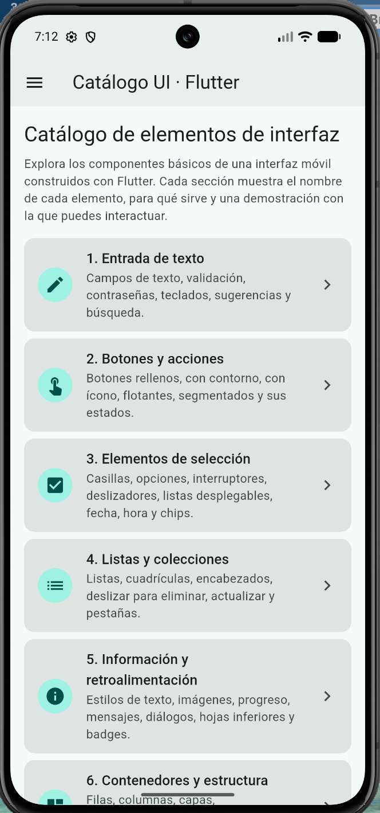 |
| 1. Entrada de texto | 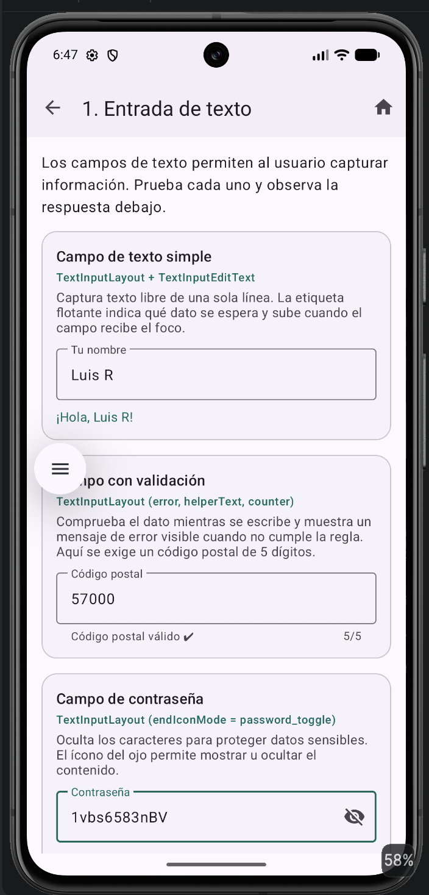 | 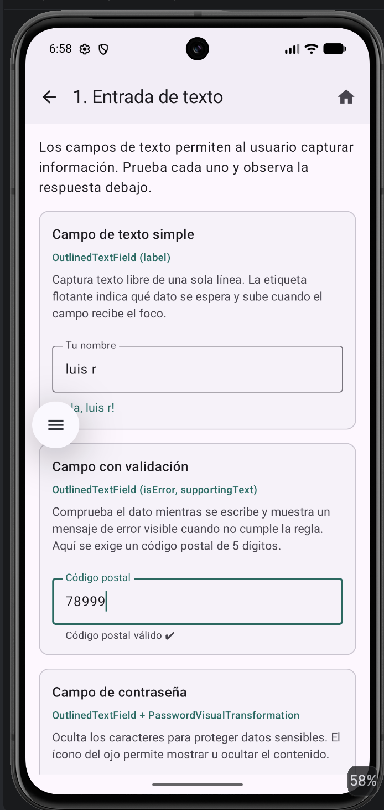 | 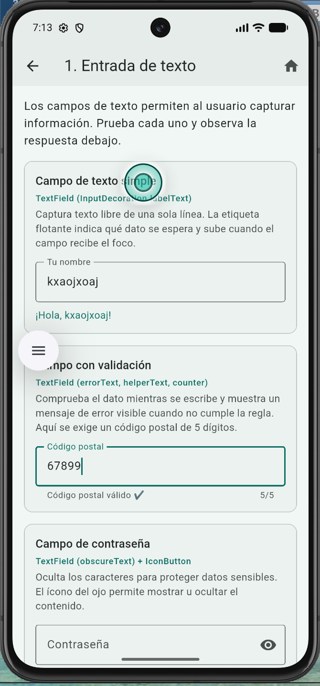 |
| 2. Botones y acciones | 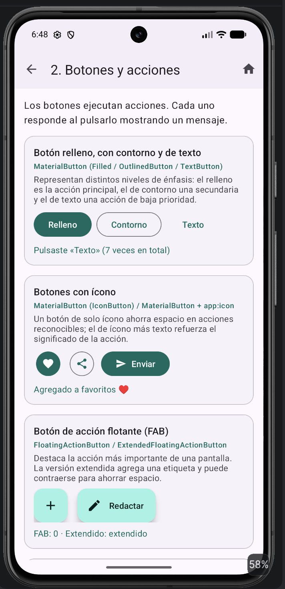 | 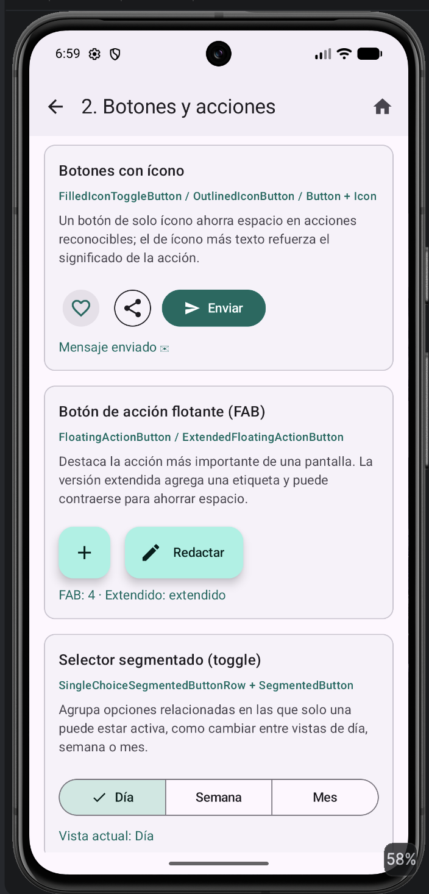 | 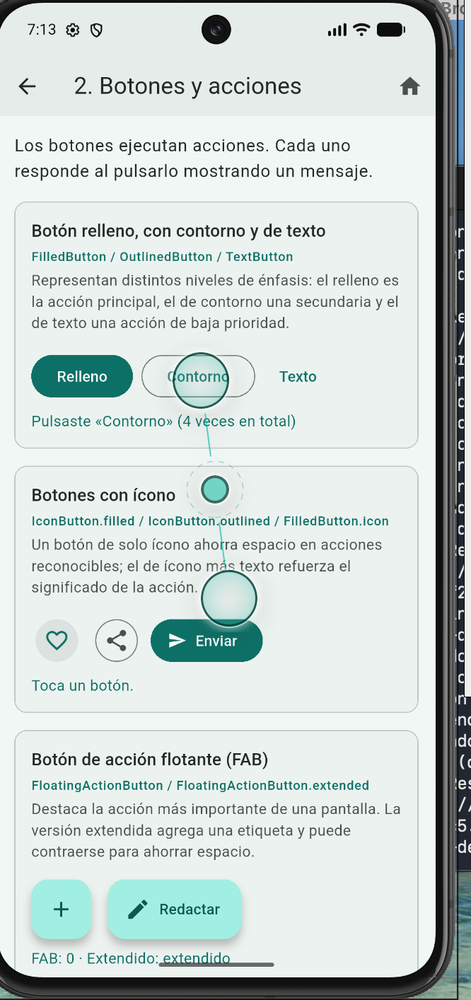 |
| 3. Elementos de selección | 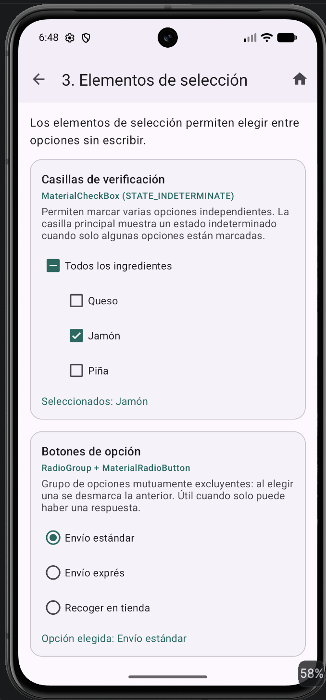 | 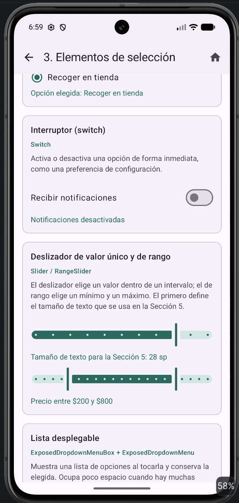 | 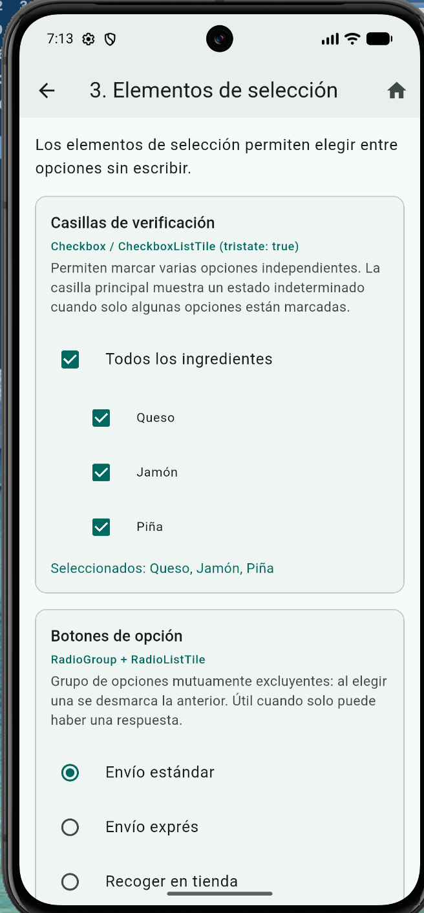 |
| 4. Listas y colecciones | 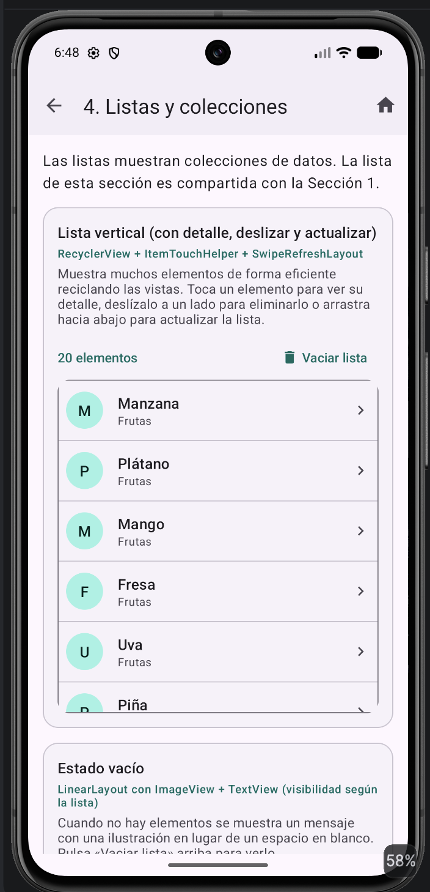 | 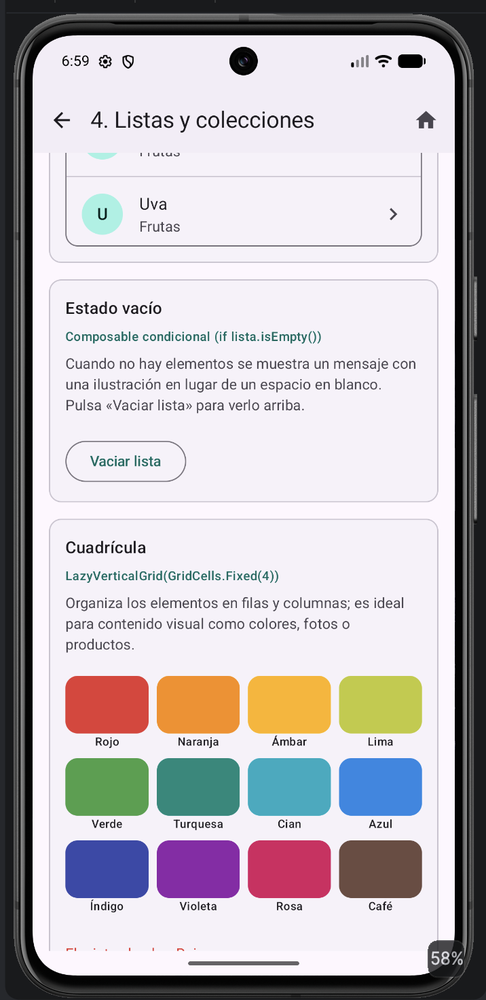 | 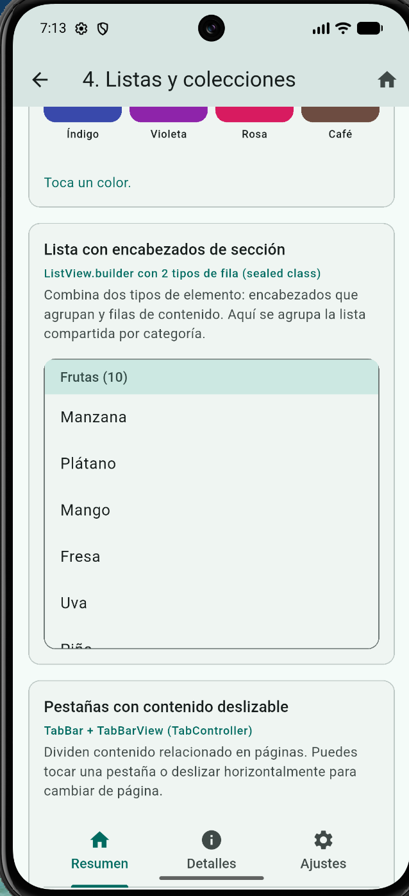 |
| 5. Información y retroalimentación | 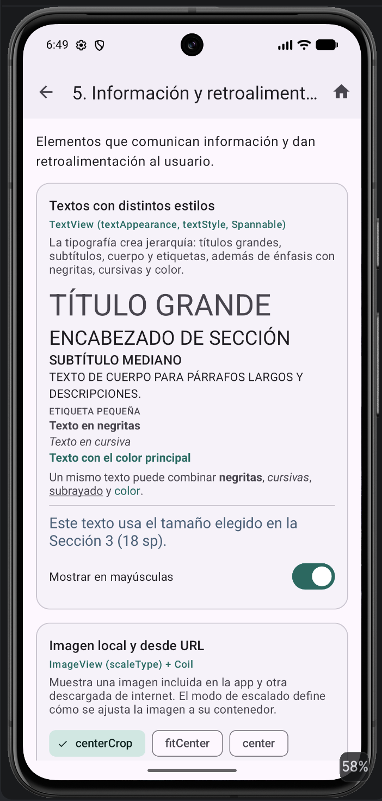 | 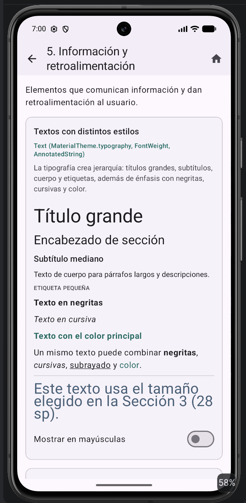 | 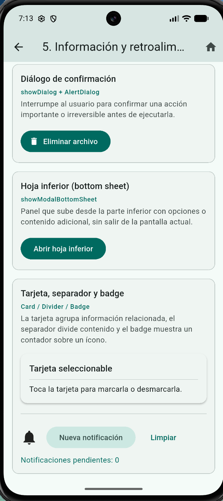 |
| 6. Contenedores y estructura | 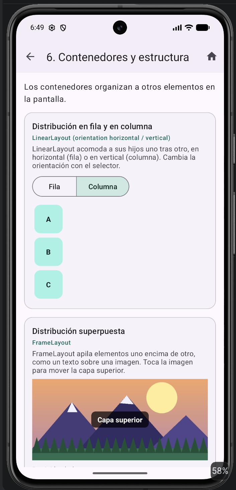 | 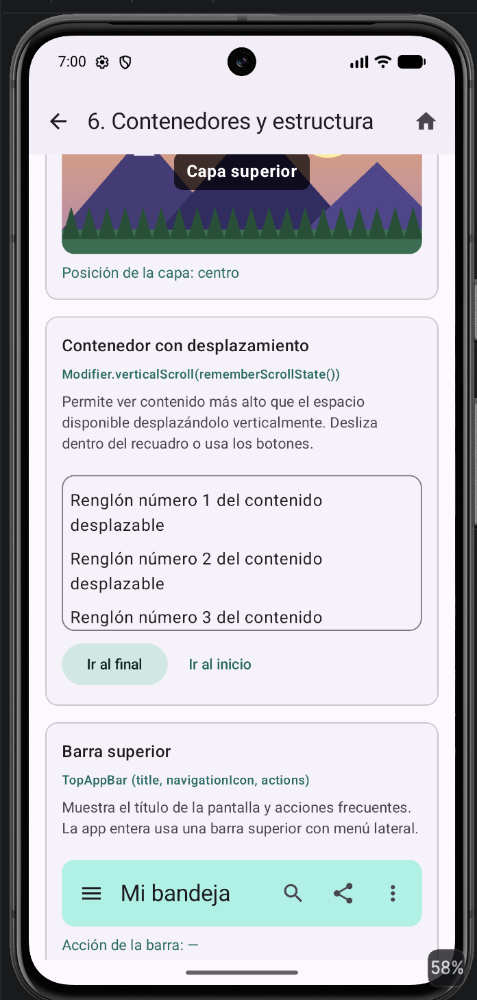 | 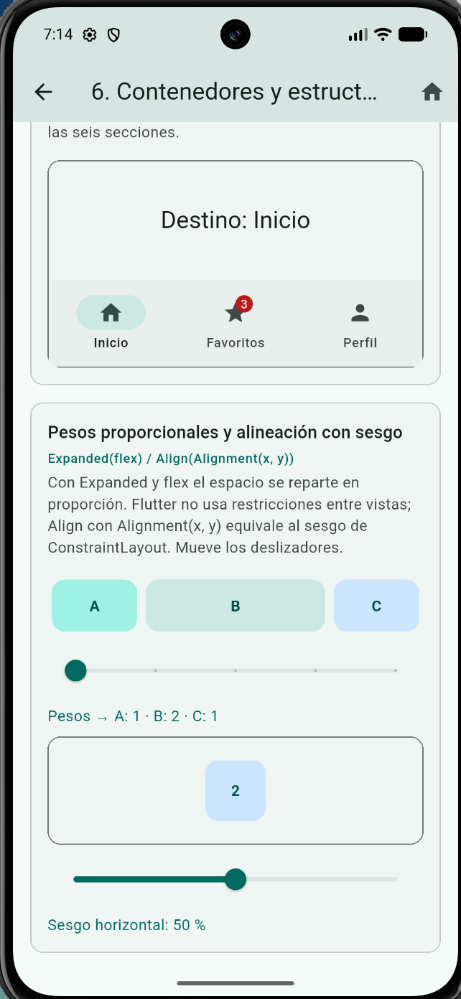 |

## Reflexión final

<!-- Borrador: revisa y ajusta esta reflexión con tu propia experiencia antes de entregar. -->

**¿En cuál tecnología fue más rápido construir la interfaz?** En Jetpack Compose y en Flutter. Ambas son declarativas: la interfaz es una función del estado, por lo que cada demostración se escribió en un solo archivo, sin IDs, sin *binding* y sin sincronizar a mano la vista con los datos. En Views cada sección requirió un layout XML, un Fragment, adaptadores para cada `RecyclerView` y recursos de texto, íconos y estilos por separado; la misma sección llevó aproximadamente el doble de líneas.

**¿Cuál generó código más legible?** Compose, seguido muy de cerca por Flutter. En Compose la jerarquía visual se lee de arriba abajo igual que en pantalla y los modificadores (`padding`, `weight`, `clickable`) quedan junto al elemento. Flutter es igual de declarativo, pero el anidamiento de widgets (`Padding` → `Column` → `Container` …) y los paréntesis de cierre alargan el código. En Views la lógica y el diseño están separados, lo que ayuda en pantallas estáticas, pero obliga a saltar entre XML y Kotlin para entender una sola interacción.

**Dificultades encontradas**

- **Views / XML:** el código repetitivo de los adaptadores y `ViewHolder`; dibujar el fondo rojo al deslizar con `ItemTouchHelper`; coordinar el estado de la casilla indeterminada evitando ciclos entre *listeners*; y que `BadgeDrawable` solo se pueda adjuntar a una vista cualquiera con una API experimental.
- **Jetpack Compose:** varias APIs de Material 3 siguen marcadas como experimentales (`@OptIn`), no existe `TimePickerDialog` ni un componente de autocompletado en la versión usada, y las listas perezosas dentro de una pantalla desplazable necesitan una altura fija.
- **Flutter:** no hay toast nativo; las carpetas de plataforma se generan con `flutter create`; algunas APIs cambian entre versiones (por ejemplo, los botones de opción pasaron a `RadioGroup`), y el permiso de Internet debe declararse a mano para el APK de *release*.

**¿Con cuál preferiría trabajar?** Con Jetpack Compose para una app exclusivamente Android, por su integración con el ecosistema (ViewModel, Navigation, Material 3) y su legibilidad. Si el proyecto necesitara también iOS o web, elegiría Flutter, porque ofrece una productividad muy parecida con un solo código para varias plataformas.

## Referencias

Android Developers. (s. f.). *Create dynamic lists with RecyclerView*. Google. Recuperado el 25 de septiembre de 2026, de https://developer.android.com/develop/ui/views/layout/recyclerview

Android Developers. (s. f.). *Jetpack Compose*. Google. Recuperado el 25 de septiembre de 2026, de https://developer.android.com/compose

Android Developers. (s. f.). *Layouts in views*. Google. Recuperado el 25 de septiembre de 2026, de https://developer.android.com/develop/ui/views/layout/declaring-layout

Android Developers. (s. f.). *Material Design 3 in Compose*. Google. Recuperado el 25 de septiembre de 2026, de https://developer.android.com/develop/ui/compose/designsystems/material3

Coil Contributors. (2024). *Coil: Image loading for Android* (versión 2.7.0) [Software]. https://coil-kt.github.io/coil/

Flutter. (s. f.). *Internationalizing Flutter apps*. Google. Recuperado el 25 de septiembre de 2026, de https://docs.flutter.dev/ui/accessibility-and-internationalization/internationalization

Flutter. (s. f.). *Widget catalog*. Google. Recuperado el 25 de septiembre de 2026, de https://docs.flutter.dev/ui/widgets

Google. (s. f.). *Material Components for Android* [Repositorio de código]. GitHub. https://github.com/material-components/material-components-android

Google. (s. f.). *Material Design 3*. Recuperado el 25 de septiembre de 2026, de https://m3.material.io/
